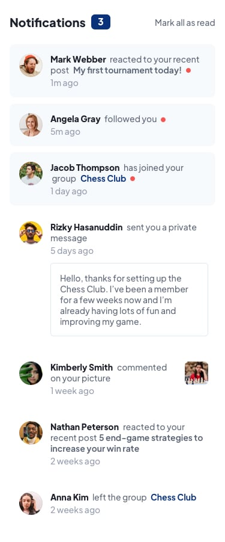

# Frontend Mentor - Notifications page solution

This is a solution to the [Notifications page challenge on Frontend Mentor](https://www.frontendmentor.io/challenges/notifications-page-DqK5QAmKbC). Frontend Mentor challenges help you improve your coding skills by building realistic projects. 

## Table of contents

- [Overview](#overview)
  - [The challenge](#the-challenge)
  - [Screenshot](#screenshot)
  - [Links](#links)
- [My process](#my-process)
  - [Built with](#built-with)
  - [What I learned](#what-i-learned)
  - [Continued development](#continued-development)
- [Author](#author)

## Overview

### The challenge

Users should be able to:

- Distinguish between "unread" and "read" notifications
- Select "Mark all as read" to toggle the visual state of the unread notifications and set the number of unread messages to zero
- View the optimal layout for the interface depending on their device's screen size
- See hover and focus states for all interactive elements on the page

### Screenshot
#### Reference (Desktop)


#### Created (Desktop 1440x900)


#### Reference (Mobile)


#### Created (Mobile 375x667)


### Links

- Solution URL: [Solution](https://www.frontendmentor.io/solutions/solution-vanilla-js-flexbox-notification-page1440x900-and-375x667-58w7oIBCCd)
- Live Site URL: [Deployment](https://wonderful-pie-de93ed.netlify.app/)

## My process

### Built with

- HTML5
- CSS
- Flexbox
- Mobile-first workflow

### What I learned

Being used to developing solely in React, it was interesting to back to a Vanilla JS enviornment. It was nice to get a refresher on things that I hadn't realized I had forgotten. One thing that stands out in particular is HTML Collections. After being greeted with an error when using forEach(), a quick search brought Array.from() back into my mind.

```js
let notificationDot = document.getElementsByClassName('new');

Array.from(notificationDot).forEach(el => {
    el.style.display = 'none'
})
```

### Continued development

Moving forward from this project and onto the next, I'd like to shift my focus towards playing around with CSS Grid. While not used in this project, my practice with Grid is rather lack luster and I'd love to get more practice creating layouts with it. 

With this project I only have it styled to look presentable in two specific device widths. In my future challenges I'd like to make the layouts fully responsive and accessible on all major device width. Doing so gives me the oppurtunity to get in a lot of practice with Grid, as well as set a good standard for myself in the way of styling for projects meant for a wide audience.

## Author

- Frontend Mentor - [@CodyyLee](https://www.frontendmentor.io/profile/CodyyLee)
- GitHub - [@CodyyLee](https://github.com/CodyyLee)